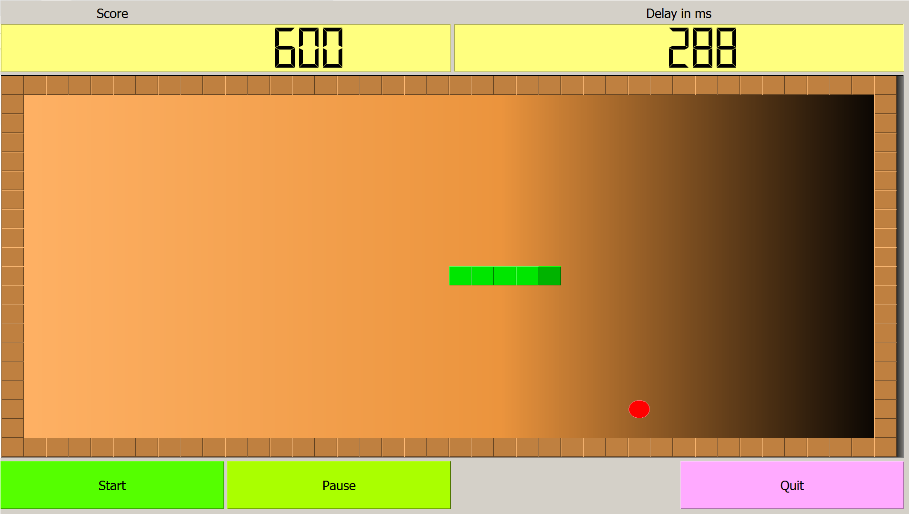

<!DOCTYPE html>
<html>

<head>
  <meta charset="UTF-8">
</head>

<body>

  <h1>Tkinter Snake Game</h1>

  
This game application is wholly made with python and the Tkinter framework. In this, we create a plain black background screen with snake boxes and a scoreboard.

  

  
Here the food is served at random on the screen. So when the snake eats the food, the score is incremented to 1.

  
Here all the characters are created in class and added to code through multiple objects. Also, the high score is stored in text file. If any cracks the highest score, then it automatically overrides the file.

  <h2>Installation</h2>

  
To run the Snake Game, follow these steps:

  <ol>
    <li>Clone the repository to your local machine.</li>
    <li>Open your terminal and navigate to the cloned repository.</li>
    <li>Run the following command to install the required dependencies:</li>
  </ol>

  <pre><code>pip install -r requirements.txt</code></pre>

  <h2>Usage</h2>

  
To start the Snake Game, run the following command:

  <pre><code>python snake.py</code></pre>

  <h2>Contributing</h2>

  
If you'd like to contribute to the project, feel free to submit a pull request.

  <h2>License</h2>

  
This project is licensed under the MIT License.

</body>

</html>
